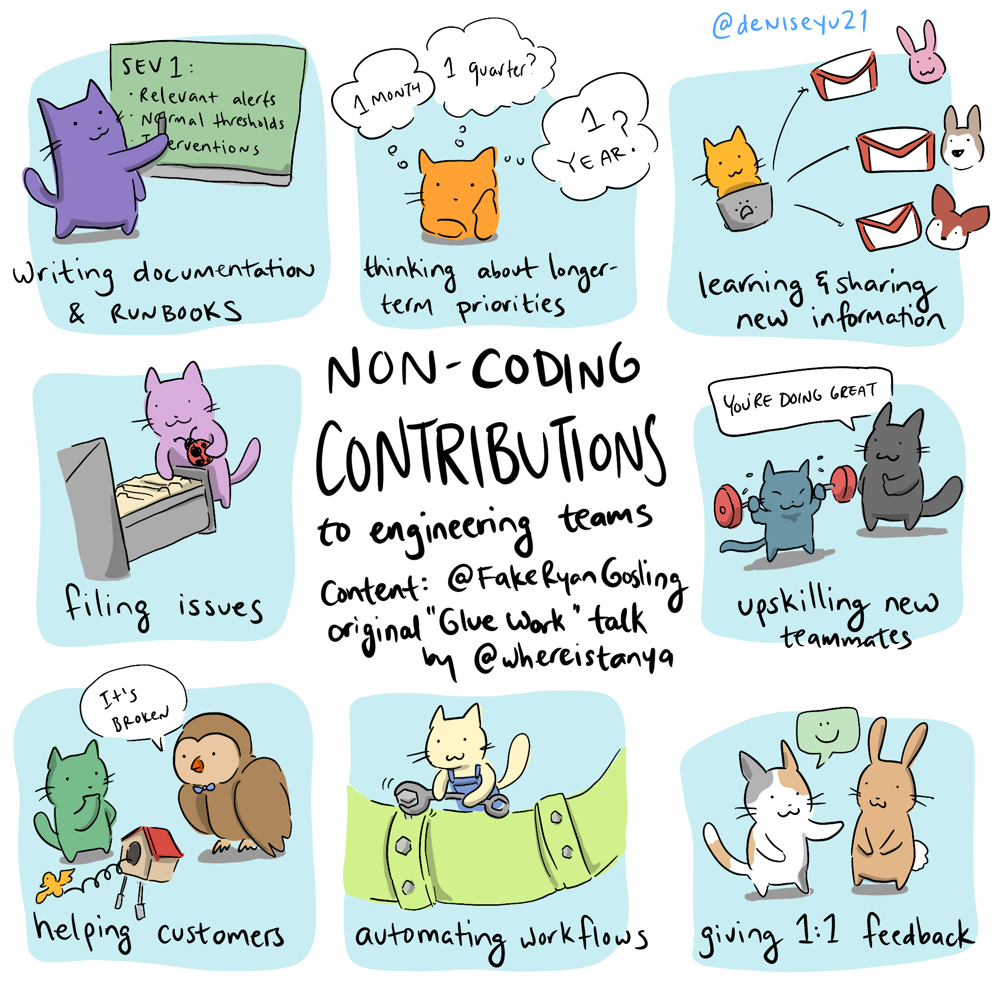
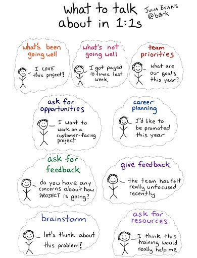
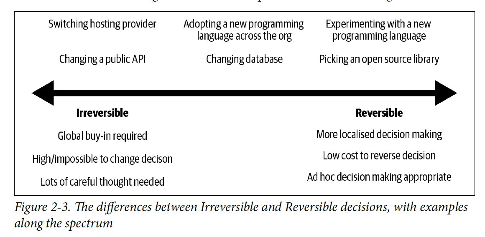
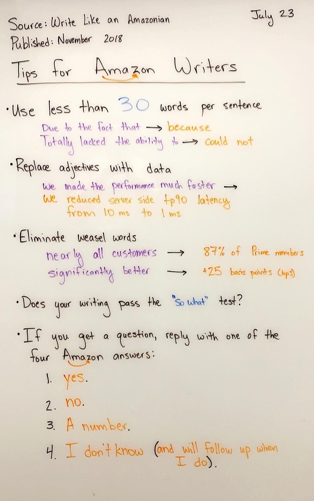
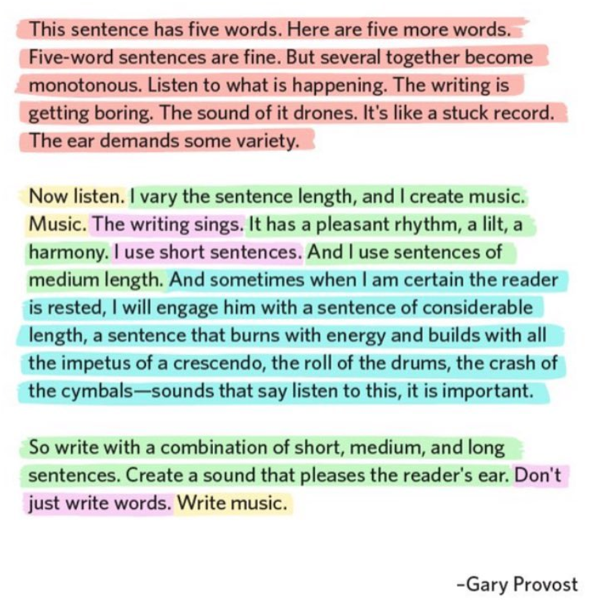

[principles]: #principles
[one-on-ones]: #one-on-ones
[coaching]: #coaching
[feedback]: #feedback
[thinking-strategically]: #thinking-strategically
[making-decisions]: #making-decisions
[coding]: #coding
[ticket-and-pr-process]: #ticket-and-pr-process
[communicating]: #communicating
[hiring]: #hiring
[onboarding]: #onboarding
[announcing-change]: #announcing-change
[managing-up]: #managing-up
[managing-sideways]: #managing-sideways
[further-reading]: #further-reading

# Manager's Playbook

Heuristics for effective management.

## Table of Contents

1. [Principles][principles]
1. [One on ones][one-on-ones]
1. [Coaching][coaching]
1. [Feedback][feedback]
1. [Thinking strategically][thinking-strategically]
1. [Making decisions][making-decisions]
1. [Coding][coding]
1. [Ticket and PR process][ticket-and-pr-process]
1. [Communicating][communicating]
1. [Hiring][hiring]
1. [Onboarding][onboarding]
1. [Managing up][managing-up]
1. [Managing sideways][managing-sideways]
1. [Announcing change][announcing-change]
1. [Further reading][further-reading]

## Principles

1. Have a bias for action and decision-making over planning and consensus.
1. Favor [writing][communicating] over meeting.
1. Understand how your products are used in the wild. For example, join sales and support calls.
1. Work backwards by focusing on the outcomes you want to achieve.
1. Encourage ownership by asking [open questions][coaching].
1. Be the cheerleader. Celebrate success often and reinforce positive behavior.
1. Know how to differentiate between [reversible and irreversible decisions][making-decisions].
1. Ensure every report is aware of the top priorities of the team, organization and company.
1. No task is beneath a manager. Get your hands dirty even if it's not coding:  
    

## One on ones

1. Never skip one on ones. It's the best platform for receiving and giving feedback. Most teammates value it and usually when they don't it's because they haven't seen one conducted well.
1. Aim for weekly one on ones.
1. Focus on 5 topics:
    - Predictability: create routine, set expectations, normalize change.
    - Ownership: offer options, clarify ownership, give more responsibilities.
    - Purpose: clarify the big picture value and importance of their tasks.
    - Progress: create milestones, share wins, celebrate progress.
    - Belonging: team culture and management.
1. Questions to help frame each topic. "On a scale of 1-10 how would you rate:..."
    - Predictability: How clear do you feel about what's expected of you?
    - Ownership: Your satisfaction with decision power and direction?
    - Purpose: How much your work makes a difference for the team?
    - Progress: The sense of progression each week?
    - Belonging: Your feeling of connection to the team?
1. Additional questions to ask on a less frequent basis:
    1. Motivators:
        1. Which part of your work is most fun?
        1. What's not fun about working here?
        1. What are the biggest time wasters for you each week?
    1. Long term goals:
        1. What skills do you want to improve?
        1. What career path are you looking for?
        1. Who in the company would you be excited to learn more from?
        1. What parts of the business would you like to be more involved in?
    1. Organization awareness:
        1. What don't you like about the product?
        1. What's the biggest opportunity that we're missing out on?
        1. What do you see as your top 3 priorities this quarter? The team’s? The org's?
        1. If you were CEO, what would you do differently?
    1. Manager's role:
        1. What could I do to support you better?
        1. If you were me, what are 1 to 3 things you would change?
        1. How do you feel about the amount of feedback you are getting?
        1. I need feedback. What are two things that I can do differently?
        1. What's one thing we could do to improve our way of collaborating?
    1. Priorities:
        1. What are your top priorities this week?
        1. What will success look like?
        1. What are obstacles?
1. Encourage your direct reports to bring up topics:  
      
1. See [Getting more from your one on ones](https://medium.com/@sbourke/getting-more-from-your-1-1s-8f71996e286e) for more thoughts on effective one on ones.
1. There isn't one best management style. Figure out how someone wants to be managed in your initial one on one:
    1. What did you like about your previous manager? What didn't you like?
    1. What do you like to see from a manager?
1. One on ones where the report is also a manager are typically more "business" where the focus is on strategy, team health and project alignment.

## Coaching

1. Default to open questions: ask questions starting with **what**, **how**, **who** instead of closed-ended ones like **do**, **have**, **is** to invite conversation and give ownership over a problem.
    - "What questions do you have?" is better than "Do you have any questions?".
    - "Why do you think this is the right approach?" is better than "Is this a good idea?".
    - Respond with "What are your thoughts so far?" when asked "What should I do?"
1. Summarize what the person is saying so you're both on the same page and are pinpointing the problem.
    -  "It sounds like there are two issues, x and y. Which should we focus on first?"
1. Figure out how to make the meeting productive:
    - "What's the next step?"
    - "How should we track this?"

## Feedback

1. Be prompt, ideally providing feedback the same day of the event that prompted it.
1. Get buy-in about providing feedback and reduce mystery by giving context:
    - "Do you have 10 minutes?"  ⛔️
    - "Do you have 10 minutes to talk about this morning's stand up?"
    - "Can I share some thoughts with you about how we've been working together?"
1. Don't pad negative feedback by beginning with compliments; it gives mixed signals.
1. Be specific even if it's positive feedback.
    - "Good job!"  ⛔️
    - "I like the initiative you took to reduce the service's memory footprint. It encourages me to give you more ownership so that I can focus elsewhere."
1. Focus on data and not behavior:
    - "I noticed you didn't address any of the comments made in your last three PRs"
    - "I noticed that you didn't pick up the ticket I asked you to do"
    - "I noticed your last feature release didn't have any tests"
    - "Your code is buggy"  ⛔️
    - "You are always late"  ⛔️
1. Talk about why this matters and who it's affecting:
    - "I mention it because it's important we work as a team"
    - "I mention it because the ticket I assigned you is critical to this quarter's roadmap"
1. Figure out together how to fix the problem:
    - "What do you think of our process?"
    - "How do you see it?"
1. Agree on an action plan:
    - "How do we ensure we don't miss a ticket due date next time?"
    - "What are a couple of actions you could take right now?"
    - "What are our action items?"
1. Highlight positive patterns (remember to be specific).
    - "It's great to see you teach X about Y so that they're as proficient as you. That's a trait of a senior engineer."
1. Replay instinctive reactions to help frame the conversation:
    - "My initial reaction to your proposal is..."
    - "Here's what I would do" is better than "Here's what you should do"
    - "When you did X, I felt Y"

## Thinking strategically

1. What would you do with one more person?
1. How is your team moving the needle? Are you focusing on the right things? How do you know the features you're building will benefit the customer?
1. What are your product's mission and tenets?
1. What is your team's morale? Have you asked them what's not fun about working here?
1. What are the company's top priorities this year? Where should the company be three years from now?
1. What are your "rocks" and "pebble" projects this quarter?
1. What company annual goals is your team driving and in what way?
1. If you were to get promoted, who from your team would take your place? What skills or experience does this person need to acquire?
1. What are your team's pain points? How can you move 2x faster?
1. How well can your team operate without you?
1. If the company failed, what would be most likely reason?
1. What ["dogs not barking"](http://www.mikepope.com/blog/AddComment.aspx?blogid=2392) do you worry about?

## Making decisions

1. Determine if the decision is [reversible vs. irreversible](https://fs.blog/2018/04/reversible-irreversible-decisions/).
    - Reversible decisions can easily be changed. Examples: changing stand up time, contributing guidelines.
    - Irreversible decisions cannot be changed without significant rework. These decisions should take
  longer and be documented and discussed. Examples: architecture changes, hiring, org changes, data models.
    - A rubric on technology decisions by [Sam Newman](https://www.amazon.com/Monolith-Microservices-Evolutionary-Patterns-Transform/dp/1492047848):
    
1. Whenever there is disagreement, focus on the intended outcome of the decision and make sure the team
is aware of your reasoning.
    - "While database X is better, I want us to standardize on one stack so that it's easier to maintain."
1. If someone disagrees with a reversible decision, set a date to revisit that decision with the team.
Ideally you also have metrics to define the success of that decision.
    - "I understand your concerns. Let's revisit this in a month and see where we stand."
    - "We're tracking X now, let's revisit next quarter if it improves with these changes."
1. If someone disagrees with an irreversible decision, give them the opportunity to present their case.
Regardless, everyone should be aware the decision is ultimately yours and the team needs
to [disagree and commit wholly](https://tomtunguz.com/disagree-and-commit/) to the decision made.
1. Document your decisions so that you can refer to why they were made and the tradeoffs your team faced.

## Coding

Avoid coding in the critical path. [Tips](https://charity.wtf/2019/01/04/engineering-management-the-pendulum-or-the-ladder/) from [Charity Majors](https://twitter.com/mipsytipsy):
  1. Authoring a feature?  ⛔️
  1. Covering on-call when someone needs a break?  ✅
  1. Diving on the biggest project after a postmortem?  ⛔️
  1. Code reviews?  ✅
  1. Picking up a p2 bug that's annoying but never seems to become top priority?  ✅
  1. Insisting that all commits be gated on their approval?  ⛔️
  1. Cleaning up the monitoring checks and writing a library to generate coverage?  ✅

## Ticket and PR process

1. Set contributing guidelines for the team.
1. PRs should small enough to be properly reviewed in under an hour.
1. Prioritize PRs to unblock tickets.
1. Automate opinions like style with linting or code formatters like [black](https://github.com/ambv/black).

## Communicating

### Writing

1. Favor long-form writing for proposals over presentations. Writing forces the author to think about the details and tradeoffs.
1. Favor enumerated lists over bullet list; they're easier to reference.
1. Encourage Amazon-style ["6 pagers" and "2 pagers"](https://medium.com/@inowland/using-6-page-and-2-page-documents-to-make-organizational-decisions-3216badde909).  
    
1. Write music.  
    
1. Examples:
    1. [It's Time to Build](https://a16z.com/2020/04/18/its-time-to-build/)
    1. [We Don’t Sell Saddles Here](https://medium.com/@stewart/we-dont-sell-saddles-here-4c59524d650d)

### Email

1. Prefix the subject with `[Action Required]` if you expect the reader to take action.
1. Structure your email in the following way (from [7 Tips for Better Executive Communication](https://medium.com/@joefletcher/7-tips-for-better-communication-32cbe84c8ddf)):
    1. First Paragraph — no more than 2 sentences. This would be the headline and critical information
    1. Second paragraph — 3–7 bullets. The more bullets, the lower line length. Aim to not wrap sentences.
    1. Third (final) paragraph — no more than 2–3 sentences focused on the action needed, follow up, and timelines.
1. "Schedule send" emails when outside of business hours unless they're just FYIs or you need an immediate response.

### Meetings

1. Avoid [shitty brainstorm sessions](https://erikbern.com/2017/12/29/toxic-meeting-culture.html) by encouraging proposals written before having a meeting.
    > "Don’t defer decisions to meetings. Make decisions on the spot, communicate it over long-form writing, and use the meeting to discuss it." – Erik Bernhardsson
1. Avoid sync or recurring meetings with no standing agenda.
1. Always end a meeting with actions, owners and timing, so it's clear what next steps are.
1. For staff meetings, go around the table and ask reports what their biggest concerns are.  
    > Many managers want to attend executive staff meetings, as it makes them feel needed and puts them in the know. I made use of this desire by setting a price of admission to the meeting: you had to fess up to at least one thing that was 'on fire.'" – Ben Horowitz
1. It's worth occasionally asking the meeting attendees whether the meeting is productive or how can it improve.
1. Before sending an invite, ask yourself why this meeting can't be communicated over email.

## Hiring

> If you can 'hire tough,' you can 'manage easy' – Sue Tetzlaff, The Employee Experience

Hiring is the most important decision a manager makes.

What to look for in senior engineers:

1. **Owner**. Takes ownership of a problem even when it's not 100% their responsibility; understands the why.
    1. "Tell me about a time when you took on something significant outside of your area of responsibility. Why was it important? What was the outcome?"
    1. "Tell me about a time when you made a hard decision to sacrifice short term gain for a longer term goal."
1. **Handles ambiguity**
    1. "Can you tell me about a time when you had to solve an ambitious problem? Why was the problem important?"
    1. "Can you tell me about a time when you had to make a decision without complete information? What was the situation? What risks did you take? Why did you make the decision you made?"
1. **Team player**. Takes feedback well.
    1. "Tell me about a time when you changed your mind about something. What was your thought process behind it?"
    1. "Tell me about a time when you disagreed with your manager. What did you learn from this situation?"
    1. "Tell me about a time when you needed the cooperation of a peer who was resistant. What did you do? What was the outcome?"
    1. "Give me an example of a tough or critical piece of feedback you received. What was it and what did you do about it?"
    1. "If I were to speak with your peers what positive or negative feedback would they have of you?"
1. **Communicator**. Can articulate ideas at different levels.
    1. "What makes a great engineer?"
    1. "Describe to me something you know well."
    1. "You mentioned X in your resume. Explain it to me as if I've never come across it?"
1. **Teacher**. Enjoys growing other engineers. Especially important for senior-level engineers.
    1. "Tell me of a time where you helped someone in your team grow."
1. **Deep diver**. Digs a level deeper to understand what's happening under the hood.
    1. "Tell me about a time you were trying to understand a problem on your team and you had to go down several layers to figure it out."
1. **Simplifier**. Simplifies problems instead of just hacks at things and adds tech debt. Does the person have a build vs. buy mentality.
    1. "Tell me a about a complex problem that you solved with a simple solution."
1. **Missionary**. Interested in company's mission or technology.
    1. "Explain to me what your current company does and why it's important."
    1. "What interests you working at [COMPANY]?"

What to watch out for:

1. **Short tenure at companies**. If a candidate typically stays at companies for less than a year, ask them why. There might be perfectly valid reasons or it might indicate a pattern that the person is difficult to work with.
    1. Why did you only work at X for less than 1 year?
1. **Menu of technologies**. Resumes that just list technologies used instead of problems solved may indicate person may not be thinking big picture. Also a typical trait of junior engineers.
1. **Long resumes**. More than 2 pages may indicate the person has difficulty distilling what's important. That being said, there can be culture reasons for long resumes. For example, in some European countries, resumes are encouraged to be long.

## Onboarding

Having a good onboarding process is crucial to the success of your team. It ensures new members are contributing as early as possible and are assimilated into your processes and culture.

An onboarding process is successful if your new team member can contribute a bug fix on their first day of joining.

Onboarding material:
1. Team mission
    1. How is your team moving the needle for the customer?
1. Team members
    1. Include: name, role/title, email, slack username, github username
1. Repositories and services
1. How to communicate within the team
    1. Slack channels
    1. Keeping yourself informed
    1. Communication protocols during and outside of business hours
1. Documentation
    1. Code contributing guidelines
    1. PR review process
    1. Ticketing process
    1. Glossary of terms
    1. Releasing code
    1. How tos (e.g. migrate database, add secrets)
1. Getting started
    1. Installation instructions (e.g. Docker, postgres).
    1. A checklist of all accesses expected (e.g. AWS, PagerDuty)
    1. Running your apps locally
    1. Deploying your first bug fix
1. Meetings. Who should your new team member meet with?

## Managing up

1. Make sure you and your manager are on the same page by sharing a document listing your project priorities, timelines and confidence levels.
1. Your manager also needs to manage up. Proactively update your manager on project timeline changes with brief answers to the following questions:
    1. What is the new timeline?
    1. Why did the timeline change?
    1. How confident are you with the new timeline?
1. Nobody cares for blame or excuses. Own mistakes and document corrective actions you will take to mitigate them going forward.

## Managing sideways

1. Get buy in by presenting the problem and not the solution.
    1. "What is the best way for us to do feature X?"
    1. "I need you to do X and here's how" ⛔️
1. Ask for timelines to hold your peer accountable on delivery dates.
1. If you disagree on an approach, document your concerns. Having an audit trail improves accountability.
1. Create project kickoffs and standups to make sure you are aware of the other team's status and priorities.

## Announcing change

1. Examples of change: promotions, reshuffles, restructuring.
1. Acknowledge the difficulty or opportunity of the change.
1. Appeal to emotions by using narrative to explain the why.
    1. Why is this change important now for the company?
    1. Who does this change affect?
1. Appeal to logic by using facts.
    1. What metrics will this change achieve?
1. Socialize the change to get buy in.
    1. Start with the people who it affects the most.
1. Examples:
    1. [Carta's covid-19 layoff](https://medium.com/@henrysward/cartas-covid-19-layoff-cbb80e3e8a5d)

## Further reading

1. [Amazon Leadership Principles](https://www.amazon.jobs/en/principles): The best principles around leadership to operate by.
1. [Manager's Path](https://www.amazon.com/Managers-Path-Leaders-Navigating-Growth/dp/1491973897/): Excellent guide for all levels of management.
1. [97 Things Every Engineering Manager Should Know](https://www.amazon.com/Things-Every-Engineering-Manager-Should-ebook/dp/B081TPX6NS): Collection of management tips from various practitioners.
1. [5 questions every Engineering Manager should be asking themselves](https://www.getclockwise.com/blog/5-questions-every-engineering-manager-should-be-asking-themselves)
1. [The Pendulum or the Ladder](https://charity.wtf/2019/01/04/engineering-management-the-pendulum-or-the-ladder/): On the challenges of being a manager who wants to stay technical.
1. [Hard Thing About Hard Things](https://www.amazon.com/Hard-Thing-About-Things-Building-ebook/dp/B00DQ845EA): More at the executive-level side but still a worthwhile.
1. [What You Do Is Who You Are](https://www.amazon.com/What-You-Do-Who-Are/dp/0062871331): Why company culture matters and how to establish one.
1. [Engineering Management Repo](https://github.com/charlax/engineering-management): Great collection of management articles.
1. [Hiring Engineering Leaders](https://medium.com/@radoshi/hiring-engineering-leaders-ca55a87db204): Hiring engineering leaders.
1. [How to Hire Smarter than the Market](https://erikbern.com/2020/01/13/how-to-hire-smarter-than-the-market-a-toy-model.html): Berkson's paradox and engineering hiring.
1. [LifeLabs Learning](https://lifelabslearning.com). Great workshop for new and experienced managers. I learned a lot from it on feedback, coaching and 1-1s.
1. [How Software Engineers Can Help Interview Their Future Managers](https://blog.newrelic.com/technology/hiring-software-engineering-managers-interview): A list of questions for engineers to ask when interviewing managers.
1. [Getting more from your one on ones](https://medium.com/@sbourke/getting-more-from-your-1-1s-8f71996e286e): How to measure successful one on ones.
1. [7 Tips for Better Executive Communication](https://medium.com/@joefletcher/7-tips-for-better-communication-32cbe84c8ddf): Tips on how to communicate effectively.
1. [Toxic Meeting Culture](https://erikbern.com/2017/12/29/toxic-meeting-culture.html): How to avoid meeting antipatterns.
