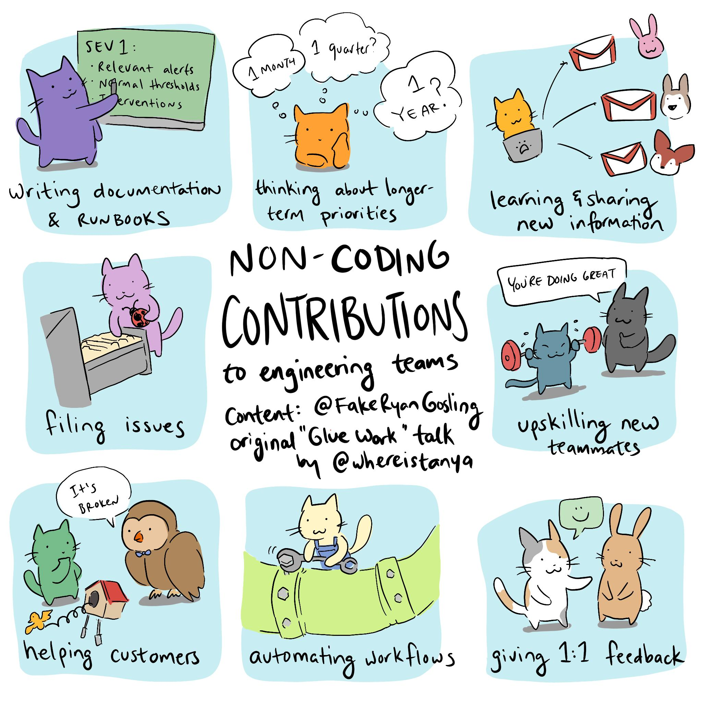

[one-on-ones]: https://github.com/ksindi/managers-playbook/blob/master/README.md#one-on-ones
[giving-advice]: https://github.com/ksindi/managers-playbook/blob/master/README.md#giving-advice
[feedback]: https://github.com/ksindi/managers-playbook/blob/master/README.md#feedback
[making-decisions]: https://github.com/ksindi/managers-playbook/blob/master/README.md#making-decisions
[coding]: https://github.com/ksindi/managers-playbook/blob/master/README.md#coding
[ticket-and-pr-process]: https://github.com/ksindi/managers-playbook/blob/master/README.md#ticket-and-pr-process
[meetings]: https://github.com/ksindi/managers-playbook/blob/master/README.md#meetings

# Manager's Playbook

Heuristics for effective management.

## Table of Contents

1. [One on ones][one-on-ones]
1. [Giving advice][giving-advice]
1. [Feedback][feedback]
1. [Making decisions][making-decisions]
1. [Coding][coding]
1. [Ticket and PR process][ticket-and-pr-process]
1. [Meetings][meetings]

## One on ones

1. Never skip one on ones. It's the best platform for getting and providing feedback.
1. Focus on 5 topics every meeting:
    - Predictability: create routine, set expectations, normalize change.
    - Ownership: offer options, clarify ownership, give more responsibilities.
    - Purpose: clarify the big picture value and importance of their tasks.
    - Progress: create milestones, share wins, celebrate progress.
    - Belonging: team culture and management.
1. Questions to help frame each topic. "On a scale of 1-10 how would you rate:..."
    - Predictability: How clear you feel about what's expected of you?
    - Ownership: Your satisfaction with decision power and direction?
    - Purpose: How much your work makes a difference for the team?
    - Progress: The sense of progression each week?
    - Belonging: Your feeling of connection to the team?
1. Additional questions to ask on a less frequent basis:
    1. Motivators:
        1. Which part of your work is most fun?
        1. What's not fun about working here?
        1. What are the biggest time wasters for you each week?
    1. Long term goals:
        1. What skills do you want to improve?
        1. What career path are you looking for?
        1. Who in the company would you be excited to learn more from?
        1. What parts of the business would you like to be more involved in?
    1. Organization awareness:
        1. What don't you like about the product?
        1. What's the biggest opportunity that we're missing out on?
        1. What do you see as your top 3 priorities this quarter? The team’s? The org's?
        1. If you were CEO, what would you do differently?
    1. Manager's role:
        1. What could I do to support you better?
        1. If you were me, what changes would you make?
        1. How do you feel about the amount of feedback you are getting?
        1. I need feedback. What are two things that I can do differently?
        1. What's one thing we could do to improve our way of collaborating?
1. Encourage your direct reports for bringing up issues in 1-1. Great [zine](https://jvns.ca/blog/2018/09/22/new-zine--help--i-have-a-manager/) by [Julia Evans](https://twitter.com/b0rk) for this.

## Giving advice

1. Open-ended questions: ask questions starting with **what**, **how**, **who** instead of closed-ended ones like **do**, **have**, **is** to invite conversation and give ownership over a problem.
    - "What questions do you have?" is better than "Do you have any questions?".
    - "Why do you think this is the right approach?" is better than "Is this a good idea?".
1. Playback: summarize what the person is saying so you're both on the same page and are pinpointing the problem.
    -  "It sounds like there are two issues, x and y. Which should we focus on first?"
1. Figure out how to make this meeting productive.
    - "What's the next step?"
    - "How should we track this?""

## Feedback

1. Be prompt, ideally providing feedback the same day of the event that prompted it.
1. Get buy-in about providing feedback and reduce mystery:
    - "Do you have 10 minutes to talk about this morning's stand up?"
    - "Can I share some thoughts with you about how we've been working together?""
1. Don't "pad" by beginning with compliments - it gives mixed signals.
1. Focus on data and not behavior:
    - "I noticed you didn't address any of the comments made in your last three PRs"
    - "I noticed that you didn't pick up the ticket I asked you to do"
    - "I noticed your last feature release didn't have any tests"
    - DON'T "Your code is buggy"
    - DON'T "You are always late"
1. Talk about why this matters and who it's affecting:
    - "I mention it because it's important we work as a team"
    - "I mention it because the ticket I assigned you is critical to this quarter's roadmap"
1. Figure out together how to fix the problem:
    - "What do you think of our process?"
    - "How do you see it?"
1. Agree on an action plan:
    - "How do we ensure we don't miss a ticket due date next time?"
    - "What are our action items?"

## Making decisions

1. Determine if the decision is [reversible vs. irreversible](https://fs.blog/2018/04/reversible-irreversible-decisions/).
    - Reversible decisions can easily be changed. Examples: changing stand up time, contributing guidelines.
    - Irreversible decisions cannot be changed without significant rework. These decisions should take
  longer and be documented and discussed. Examples: architecture changes, language decision, data models.  
1. Whenever there is disagreement, focus on the intended outcome of the decision and make sure the team
is aware of your reasoning.
    - "While database X is better, I want us to standardize on one stack so that it's easier to maintain."
1. If someone disagrees with a reversible decision, set a date to revisit that decision with the team.
Ideally you also have metrics to define the success of that decision.
    - "I understand your concerns. Let's revisit this in a month and see where we stand."
    - "We're tracking X now, let's revisit next quarter if it improves with these changes."
1. If someone disagrees with an irreversible decision, give them the opportunity to present their case.
Regardless, everyone should be aware the decision is ultimately yours and the team needs
to [disagree and commit wholly](https://tomtunguz.com/disagree-and-commit/) to the decision made.

## Coding

1. As a rule of thumb, a manager should spend their time coding roughly `(1 - NUM_DIRECT_REPORTS * 10%)%`.
1. Even when not coding, managers should be getting their "hands dirty" and contributing in different ways:
      
    [credit](https://twitter.com/deniseyu21/status/1112494446040489984)
1. If managing more than 5 people, avoid coding in the critical path. [Tips](https://charity.wtf/2019/01/04/engineering-management-the-pendulum-or-the-ladder/) from [Charity Majors](https://twitter.com/mipsytipsy):
    - Authoring a feature?  ⛔️
    - Covering on-call when someone needs a break?  ✅
    - Diving on the biggest project after a postmortem?  ⛔️
    - Code reviews?  ✅
    - Picking up a p2 bug that's annoying but never seems to become top priority?  ✅
    - Insisting that all commits be gated on their approval?  ⛔️
    - Cleaning up the monitoring checks and writing a library to generate coverage?  ✅

## Ticket and PR process

1. Set contributing guidelines for the team.
1. PRs should always be prioritized. Aim for review SLA of 1 hour.
1. Limit WIP tickets by an engineer to max 2.
1. Automate opinions like style with linting or code formatters like [black](https://github.com/ambv/black).

## Meetings

- Avoid [shitty brainstorm sessions](https://erikbern.com/2017/12/29/toxic-meeting-culture.html). Meetings should be for decisioning. Encourage others to research the problem and make a proposal coming into a meeting.
- If no decision is made, have a note taker and always end a meeting with actions, owners and timing.
- Encourage ["6 pagers" and "2 pagers"](https://medium.com/@inowland/using-6-page-and-2-page-documents-to-make-organizational-decisions-3216badde909).
